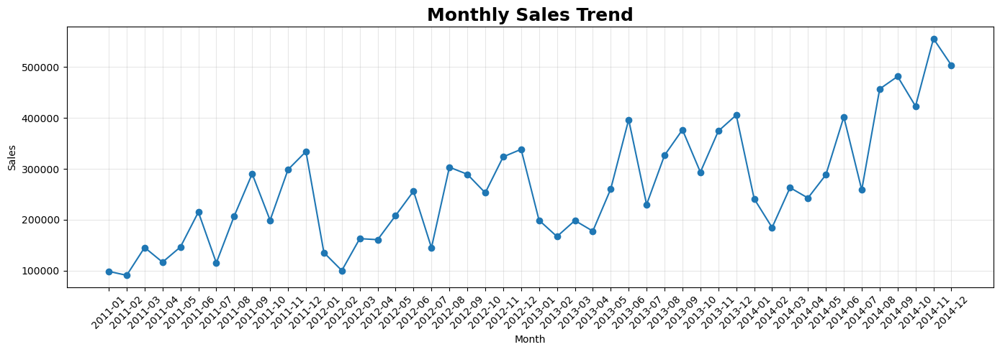
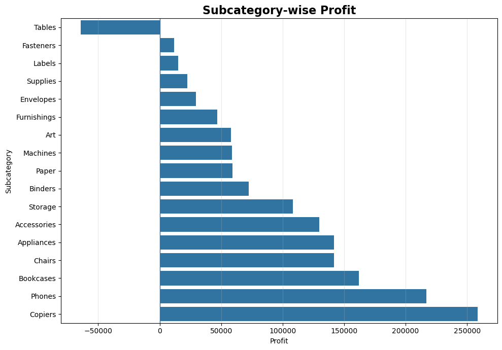
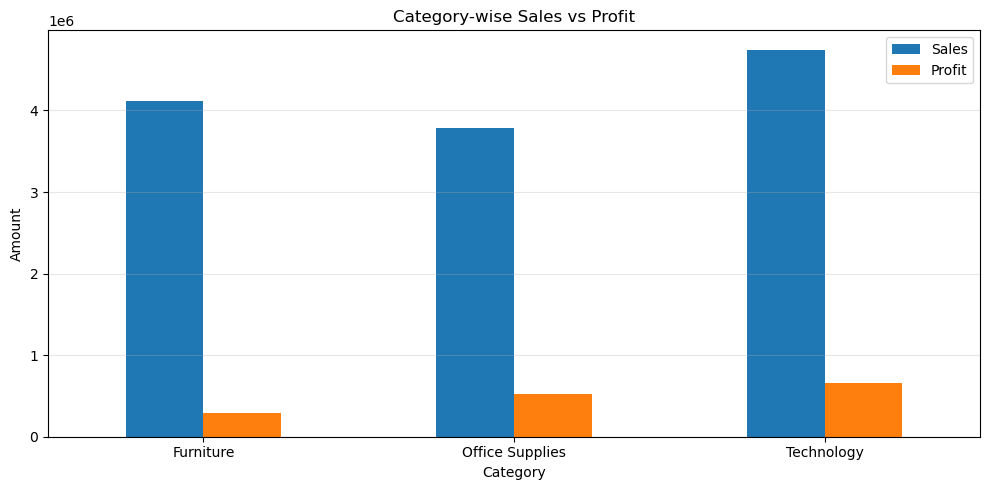
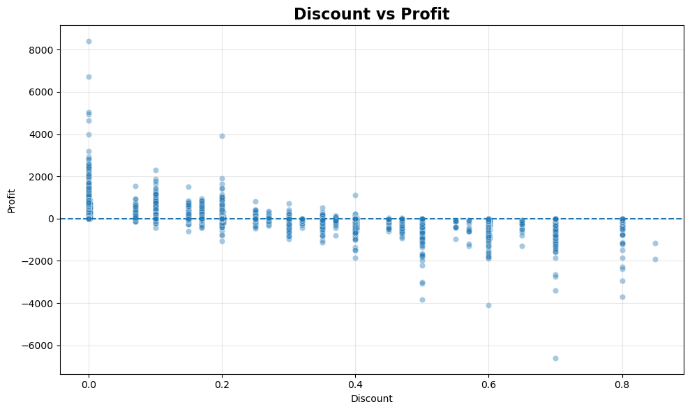

# Superstore Sales Analysis

Exploratory Data Analysis (EDA) of 4 years of Superstore order data (2011–2014) using **Python, Pandas, Matplotlib and Seaborn**.
The goal is to find out **what drives sales and profit** and **where the business is losing money**.

📓 **Notebook:** [`Superstore_Sales_Analysis.ipynb`](Superstore_Sales_Analysis.ipynb)

---

## Dataset
- File: `SuperStoreOrders.csv` (51,290 transactions, 21 columns, Jan 2011 – Dec 2014)
- Contains order, customer, segment, region, product, sales, quantity, discount, profit and shipping cost details
- The CSV is not included in this repository. See [`data/README.md`](data/README.md) for where to place it.

## Business Questions
1. What are the overall sales, profit and profit margin?
2. Which categories, sub-categories, regions and segments perform best and worst?
3. Do discounts hurt profit?
4. Which customers and products make losses, and why?
5. How do sales and profit change over time?

## What I Did
- **Data cleaning:** converted `sales` (text with commas) to numbers and fixed mixed-format dates
- **Data quality checks:** missing values, duplicates, zero/negative sales, invalid quantity and discount
- **Business analysis:** KPIs, category, sub-category, region, segment, customer, product and monthly/yearly trends
- **Deep dives:** why Tables lose money, and why some customers are loss-making
- **Statistical EDA:** distributions, IQR outliers, correlations
- **Insights and recommendations** written after every section

## Key Findings
- Total sales **\$12.64M**, total profit **\$1.47M**, profit margin **11.62%**, 25,035 orders
- **Discounts are the biggest profit leak.** Transactions with a discount above 20% (22% of all transactions) lost about **\$815K**, while transactions with no discount earned \$1.77M
- **Tables** is the only loss-making sub-category (**-\$64K**). It earns about 23% margin at 0% discount but loses money at every discount of 30% or more
- **Technology** gives 45% of total profit. **Furniture** gives 32.5% of sales but only 19.5% of profit (6.98% margin)
- **Southeast Asia (2.0%), EMEA (5.5%) and South (8.8%)** have the weakest profit margins
- Sales grew about **90% from 2011 to 2014** with a stable 11–12% margin. Q4 brings 31–37% of yearly sales
- A few heavily discounted orders (e.g. a 3D printer sold at 70% discount) can create large losses for otherwise good customers

## Recommendations
- Cap discounts at about 20% and add an approval step for higher discounts
- Review pricing and discounts for Tables, Machines, Chairs and Storage
- Check low-margin regions for heavy discounting and other costs
- Plan stock and campaigns around the Q4 and June peaks

## Charts

| | |
|---|---|
|  |  |
|  |  |

## Project Structure
```
Superstore-Sales-Analysis/
├── Superstore_Sales_Analysis.ipynb   # Main analysis notebook
├── data/                             # Put SuperStoreOrders.csv here
├── images/                           # Charts used in this README
├── outputs/                          # Exported summary CSV (created when notebook runs)
├── requirements.txt
└── README.md
```

## How to Run
```bash
git clone https://github.com/AshutoshNagaich/Superstore-Sales-Analysis.git
cd Superstore-Sales-Analysis
pip install -r requirements.txt
# add data/SuperStoreOrders.csv, then:
jupyter notebook Superstore_Sales_Analysis.ipynb
```

## Limitations and Next Steps
- The analysis is descriptive: it shows what happened, not a proven reason why
- Product cost is not available in the data
- Next: analyse shipping cost and delivery time, build a Power BI dashboard, and try a simple sales forecast

## Author
**Ashutosh Nagaich** — [GitHub](https://github.com/AshutoshNagaich) · [LinkedIn](https://www.linkedin.com/in/ashutosh-nagaich-58bab6288)
